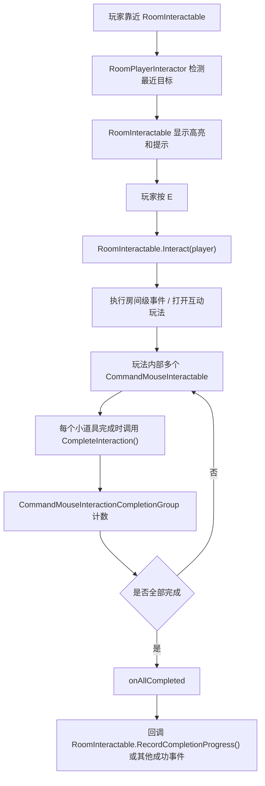

# Room And Command Interaction System Guide

这份文档用于帮助下一次接手项目的 AI 或开发者快速理解房间交互系统。重点说明两套交互的边界：

- `RoomInteractable`：玩家靠近物体后按交互键触发，负责房间级入口、提示、高亮、进度记录、条件解锁。
- `CommandMouseInteractable`：进入某个互动玩法后，用鼠标射线点击具体小道具，负责玩法内部的小物件选择、高亮、点击和完成状态。

不要让 `RoomInteractable` 直接猜玩法内部有多少小道具完成。玩法内部如果有多个 `CommandMouseInteractable`，应该使用 `CommandMouseInteractionCompletionGroup` 收集它们的完成状态，全部完成后再回调外层 `RoomInteractable`。

## 常用源码位置

- `Assets/Script/Room/RoomInteractable.cs`
- `Assets/Script/Room/RoomPlayerInteractor.cs`
- `Assets/Script/Room/RoomInteractableHighlight.cs`
- `Assets/Script/Room/RoomInteractionProgressManager.cs`
- `Assets/Script/Room/RoomInteractionProgressEventTrigger.cs`
- `Assets/Script/Room/RoomInteractionUnlockConditions.cs`
- `Assets/Script/Room/RoomInteractionBehaviour.cs`
- `Assets/Script/Room/RoomInteractionAction.cs`
- `Assets/Script/Room/RoomTopDownPlayerMovementControlSetter.cs`
- `Assets/Script/Command/CommandMouseInteractable.cs`
- `Assets/Script/Command/CommandMouseInteractionCompletionGroup.cs`
- `Assets/Script/Command/CommandTopDownPlayerMovementControlBehaviour.cs`
- `Assets/Script/Command/CommandTopDownPlayerMovementControlSetter.cs`
- `Assets/Script/Command/CommandEnableTopDownPlayerMovementControl.cs`
- `Assets/Script/Command/CommandDisableTopDownPlayerMovementControl.cs`
- `Assets/Script/Command/CommandToothbrushSwipeInteraction.cs`
- `Assets/Script/Command/CommandMedicineBottleInteraction.cs`

## 总体流程



## RoomInteractable 职责

`RoomInteractable` 是房间级交互入口。它不负责具体小游戏规则，只负责“玩家是否能交互”和“交互后触发什么”。

### Detection

- `isInteractable`：是否允许被 `RoomPlayerInteractor` 检测。关闭后不会出现提示和高亮，也不会响应按键交互。
- `detectionCenter`：距离检测中心。为空时使用自身 `transform.position`。
- `interactionRange`：玩家距离小于等于这个值时可交互。
- `ignoreVerticalDistance`：开启后只按 XZ 平面距离判断，适合桌面物品、地面物品等高度差场景。

`RoomPlayerInteractor` 每帧遍历 `RoomInteractable.ActiveInteractables`，找到范围内最近的一个作为 `CurrentTarget`。范围内的物体会高亮，最近的那个会被标记为 current target。

### Prompt

- `promptText`：提示文本，支持 `{key}` 占位符，例如 `按下 {key} 进行交互`。
- `promptAnchor`：提示 UI 跟随的世界坐标锚点。为空时使用自身 Transform。
- `promptWorldOffset`：提示锚点偏移。

`RoomInteractionPromptUI` 会显示当前目标的提示文本。

### Highlight

- `highlightController`：控制高亮表现的 `RoomInteractableHighlight`。
- `autoFindHighlightController`：为空时自动从子物体查找。

`RoomInteractable.SetHighlightState(highlighted, currentTarget)` 会转发给 `RoomInteractableHighlight`，并触发：

- `onHighlightChanged(bool)`
- `onCurrentTargetChanged(bool)`

### Interaction Logic

主互动触发时会按顺序执行：

1. `interactionBehaviours`
2. `interactionActions`
3. `onInteract`
4. `onInteractWithPlayer`
5. `onInteractWithTarget`
6. 打开次数记录
7. resume state 保存

`RoomInteractionBehaviour` 是场景组件形式的行为基类，适合拖场景对象引用。

`RoomInteractionAction` 是 `ScriptableObject` 形式的行为基类，适合复用规则资源。

`RoomUnityEventInteractionBehaviour` 是通用事件行为，适合在 Inspector 里直接绑定 UnityEvent。

### Resume State

`RoomInteractionResumeOverride` 用于在互动执行后保存当前步骤的继续位置。

- `saveResumeTransformOnInteract`：是否保存。
- `resumeTransform`：继续游戏时玩家应回到的坐标。
- `saveRotation`：是否保存旋转。

保存逻辑走 `RoomInteractionProgressManager.Instance.SetResumeStateFromTransform(...)`。

### Progress

`RoomInteractable` 使用一个 `progressId` 记录两类次数：

- `Open`：按 E 打开/进入过几次。
- `Completion`：玩法真正通过几次。

字段说明：

- `progressId`：这个互动共享的进度 ID。为空则不记录。
- `openProgressIncrement`：每次按 E 成功打开时增加多少 Open 次数。
- `completionTaskProgressIncrement`：玩法完成时增加多少 Completion 次数。
- `onOpenProgressRecorded`：Open 次数写入后触发。
- `onCompletionTaskProgressRecorded`：Completion 次数写入后触发。

重要规则：

- 按 E 进入玩法只应该记录 `Open`。
- 玩法真正完成后才调用 `RecordCompletionProgress()`。
- 如果玩法里有多个鼠标小道具，必须等 `CommandMouseInteractionCompletionGroup.onAllCompleted` 后再调用 `RecordCompletionProgress()`。

### Conditional Interaction

`useConditionalInteraction` 开启后，`RoomInteractable` 会先检查 `unlockConditions`：

- 条件满足：执行主互动。
- 条件不满足但 `defaultInteraction` 有配置：执行默认互动。
- 条件不满足且没有默认互动：不可检测。

`RoomInteractionUnlockConditions` 可检查：

- 当前步骤内某些 `progressId` 的 Open/Completion 次数。
- 当前场景通关次数。
- 指定场景通关次数。

`RoomInteractionVariant defaultInteraction` 是条件不满足时的备用互动，内部也有 prompt override、事件、behaviour/action 和 resume override。

## RoomInteractableHighlight 职责

`RoomInteractableHighlight` 只负责表现，不做交互判定。

它可以控制：

- `highlightedObjects`：普通高亮时启用的对象。
- `highlightedBehaviours`：普通高亮时启用的组件。
- `highlightRenderers` + `highlightedOverlayMaterial`：给 Renderer 追加高亮材质。
- `currentTargetObjects`：当前最近目标时额外启用的对象。
- `currentTargetBehaviours`：当前最近目标时额外启用的组件。
- `currentTargetOverlayMaterial`：当前最近目标额外追加的材质。

材质高亮是“追加材质再恢复原材质”的方式。不要在外部直接改这些 Renderer 的 `materials`，否则可能和高亮缓存冲突。

## RoomPlayerInteractor 职责

`RoomPlayerInteractor` 挂在玩家身上。

- `detectionOrigin`：检测点。为空时使用玩家自身。
- `interactionKey`：默认 `E`。
- `promptUI`：提示 UI，可自动查找。

每帧会：

1. 找到所有可检测的 `RoomInteractable`。
2. 给范围内物体设置普通高亮。
3. 选择最近的目标作为 current target。
4. 显示对应提示。
5. 玩家按交互键时调用 `CurrentTarget.Interact(gameObject)`。

## RoomInteractionProgressManager 职责

这是全局进度管理器，会 `DontDestroyOnLoad`。

进度按 scope 保存：

- 优先使用当前 `GameFlow` 的 stepId，scope 形如 `step:xxx`。
- 如果没有有效 stepId，退回当前场景名，scope 形如 `scene:room`。

同一个 `progressId` 下分别保存：

- `completionCount`
- `openCount`

常用 API：

- `MarkOpened(progressId)`
- `MarkCompleted(progressId)`
- `MarkProgress(progressId, countType, increment)`
- `GetProgressCount(progressId, countType)`
- `IsCompleted(progressId, minimumCompletionCount)`
- `SetResumeStateFromTransform(transform)`
- `ClearCurrentProgress()`

`RoomInteractionProgressEventTrigger` 可以监听某个 `progressId` 达到指定次数后触发事件，适合把 Timeline、显隐物体、流程跳转等表现逻辑挂回场景对象。

## CommandMouseInteractable 职责

`CommandMouseInteractable` 是玩法内部的鼠标小道具交互组件。

它和 `RoomInteractable` 的区别：

- `RoomInteractable` 是玩家靠近后按 E 的房间入口。
- `CommandMouseInteractable` 是进入玩法后，用鼠标指向并点击的小对象。

### Detection

- `targetCamera`：射线相机。为空且 `autoUseMainCamera` 开启时使用 `Camera.main`。
- `raycastLayers`：射线层级。
- `maxRaycastDistance`：最大射线距离。
- `triggerInteraction`：是否命中 Trigger。
- `ignoreWhenPointerOverUI`：鼠标在 UI 上时是否忽略场景射线。

### State

- `isInteractable`：关闭后不会被鼠标射线检测、点击或显示高亮。
- `disableInteractionOnCompleted`：调用 `CompleteInteraction()` 后自动关闭选择和高亮。
- `IsCompleted`：只读完成状态。

### Highlight

- `targetRenderers`：要追加高亮材质的 Renderer。
- `autoFindRenderers`：为空时自动收集当前物体和子物体 Renderer。
- `hoverGlowMaterial`：鼠标悬停时追加的材质。

### Events

- `onHoverEnter`
- `onHoverExit`
- `onClick`
- `onClickObject(GameObject)`
- `onClickCollider(Collider)`
- `onCompleted`
- `onCompletedObject(GameObject)`

调用 `CompleteInteraction()` 后会：

1. 清掉 hover 状态和高亮材质。
2. 标记 `IsCompleted = true`。
3. 触发完成事件。
4. 如果 `disableInteractionOnCompleted` 为 true，关闭 `isInteractable`，防止再次被选中或高亮。

调用 `ResetCompletion()` 会重置完成状态并重新允许交互。

## 多个 CommandMouseInteractable 的全部完成判断

使用 `CommandMouseInteractionCompletionGroup`。

把它挂在一个玩法根节点上，例如 `BathroomMiniGameRoot`。

配置方式：

1. 将玩法内部所有必须完成的小道具挂上 `CommandMouseInteractable`。
2. 每个小道具自己的玩法通过时调用 `CommandMouseInteractable.CompleteInteraction()`。
3. 在根节点挂 `CommandMouseInteractionCompletionGroup`。
4. 手动填 `requiredInteractables`，或者开启 `autoFindInteractablesInChildren` 让它自动从子物体收集。
5. 在 `onAllCompleted` 里绑定外层 `RoomInteractable.RecordCompletionProgress()`，或者绑定关闭 UI、推进剧情、播放 Timeline 等成功事件。

这个组件内部用完成集合计数，不限制完成顺序。玩家可以任意选择互动顺序，只要所有 required item 都完成，就触发一次 `onAllCompleted`。

重要字段：

- `requiredInteractables`：需要全部完成的小道具。
- `autoFindInteractablesInChildren`：自动从子物体找。
- `includeInactiveChildren`：自动查找时是否包含 inactive 子物体。
- `countAlreadyCompletedOnEnable`：启用时是否把已经完成的小道具计入进度。
- `invokeAllCompletedOnce`：全部完成事件是否只触发一次。
- `invokeWhenEmpty`：没有任何 required item 时是否也算完成。一般保持 false，避免漏配。
- `onItemCompleted(GameObject)`：单个小道具完成。
- `onAllCompleted()`：全部完成。

## 通用功能规范

当需求里明确说“通用”时，如果是新加功能，默认同时考虑 Room 和 Command 两套入口，除非用户明确只要其中一套。

- 房间级按 E 触发的通用功能，优先新增或扩展 `RoomInteractionBehaviour` 实现，放在 `Assets/Script/Room`。
- 玩法内部鼠标点击、Timeline、UnityEvent 可直接绑定的通用功能，优先新增或扩展 `Command` 组件，放在 `Assets/Script/Command`，并加 `AddComponentMenu("Command/...")`。
- 如果这个 Command 通用功能也需要被 `RoomInteractable.interactionBehaviours` 或其它房间交互流程调用，Command 组件也要继承 `RoomInteractionBehaviour` 并实现 `Execute(RoomInteractionContext context)`。
- 如果功能作用在共享运行时状态上，例如玩家移动控制，优先把真正的状态开关和公开 API 放在被控制组件本身，再由 Room/Command 两侧的适配组件调用，避免两边复制核心逻辑。
- 对于开启/关闭这类二态流程，除了可配置 Setter，也优先提供固定语义脚本，例如 `EnableX` 和 `DisableX`，方便在其它交互脚本里直接拖对应流程。
- Command 通用组件要提供无参数方法，方便绑定到 `UnityEvent`；需要布尔值时，同时提供 `SetX(bool)` 和明确的 `EnableX()` / `DisableX()` 包装方法。
- 用户说明“不用编译”或“我自己进编辑器编译”时，不运行 Unity 编译或 `dotnet build`，只做代码与轻量文本检查。

### RoomTopDownPlayerMovement 控制开关

`RoomTopDownPlayerMovement` 提供 `SetMovementControlEnabled(bool)`。关闭后不响应 WASD/方向键移动输入，并会清理脚步声、移动按键状态和 Walk 动画状态。

Room 入口使用 `RoomTopDownPlayerMovementControlSetter`：

- 挂在任意 `RoomInteractable` 相关对象上。
- 放进 `interactionBehaviours`。
- `targetMovement` 可手动拖玩家的 `RoomTopDownPlayerMovement`。
- `targetMovement` 留空时，默认从互动上下文里的玩家对象上查找。
- `movementControlEnabled` 不勾选为屏蔽移动控制，勾选为恢复移动控制。

Command 入口使用以下脚本：

- `CommandTopDownPlayerMovementControlSetter`：可配置开启或关闭，适合需要一个组件通过布尔值切换两种状态的情况。
- `CommandEnableTopDownPlayerMovementControl`：固定开启移动控制，适合直接放进 `interactionBehaviours` 或绑定到恢复流程。
- `CommandDisableTopDownPlayerMovementControl`：固定关闭移动控制，适合直接放进 `interactionBehaviours` 或绑定到屏蔽流程。
- 三个脚本都继承 `RoomInteractionBehaviour`，可以被 `RoomInteractable.interactionBehaviours` 调用，也可以绑定 `CommandMouseInteractable.onClick`、玩法完成事件、Timeline Signal 或其它 `UnityEvent`。
- 常用 UnityEvent 绑定方法：`ApplyConfiguredState()`、`EnableMovementControl()`、`DisableMovementControl()`、`Apply()`、`SetMovementControlEnabled(bool)`。
- `targetMovement` 可手动拖玩家的 `RoomTopDownPlayerMovement`；留空时可从 `RoomInteractionContext.Player`、当前对象子物体或场景中查找。

## 牙刷左右滑动玩法

使用 `CommandToothbrushSwipeInteraction`。

挂在牙刷对象上，牙刷对象也需要有 `CommandMouseInteractable` 和 Collider。

运行规则：

1. 鼠标射线悬停牙刷时，`CommandMouseInteractable` 显示高亮。
2. 玩家按下鼠标左键，`CommandMouseInteractable.onClick` 触发 `BeginSwipe()`。
3. 按住鼠标左右拖动，牙刷沿 `localSlideAxis` 在 `slideRange` 内移动。
4. 从一侧端点滑到另一侧端点算一次。
5. 达到 `requiredSwipeCount` 后调用 `CompleteInteraction()`。
6. 可隐藏 `objectsToHideOnCompleted`，显示 `objectsToShowOnCompleted`。
7. 默认会调用牙刷的 `CommandMouseInteractable.CompleteInteraction()`，使牙刷不再高亮/可选。
8. 如果牙刷在 `CommandMouseInteractionCompletionGroup.requiredInteractables` 里，组会收到完成事件。

关键字段：

- `mouseInteractable`：牙刷的鼠标交互组件。为空时自动获取当前物体上的组件。
- `slideTarget`：实际移动的 Transform。为空时移动当前物体。
- `localSlideAxis`：本地滑动方向，默认 Local X。
- `slideRange`：左右单侧最大距离。
- `mouseSensitivity`：鼠标横向移动到模型位移的倍率。
- `endpointThreshold`：滑到单侧范围多少比例后算到端点。
- `requiredSwipeCount`：需要完成几次左右滑动。
- `completeCommandInteractable`：通过后是否自动标记 `CommandMouseInteractable` 完成。

## 药瓶旋转、开盖、倒药玩法

使用 `CommandMedicineBottleInteraction`。

脚本挂在药瓶玩法 Root 上。入口 `CommandMouseInteractable` 可以只负责打开这个玩法对象；药瓶玩法对象激活后，`CommandMedicineBottleInteraction` 可以自己用 `interactionCamera` 做射线检测，不要求药瓶 Root 自己也挂 `CommandMouseInteractable`。Root 下有两个子模型：药盖和瓶身，它们需要各自有 Collider，或者子物体里有 Collider。

如果药瓶玩法使用独立摄像机，不是 `Main Camera`，在 `CommandMedicineBottleInteraction.interactionCamera` 填这个摄像机，并保持 `applyInteractionCameraToMouseInteractable` 开启。脚本会自动把这个摄像机写到 Root 的 `CommandMouseInteractable.targetCamera`，同时关闭 `autoUseMainCamera`。药瓶玩法默认开启 `allowInteractionWhenPointerOverUI`，因此即使鼠标处在 UI/遮罩上，也允许该玩法继续做 3D 射线检测。

默认情况下，`enableDirectMouseInput` 会让药瓶脚本自己处理玩法内点击和拖动。只要玩法 Root 处于 Active 状态，点击药盖/瓶身 Collider 就能进入逻辑。

如果药瓶 Root 自己也挂了 `CommandMouseInteractable`，`autoBindMouseInteractableClick` 可以自动监听它的 `onClickCollider`。如果想完全手动管理事件链，可以关闭这个选项，然后按下面方式绑定。

手动绑定方式：

- Root 的 `CommandMouseInteractable.onClickCollider` -> Root 上的 `CommandMedicineBottleInteraction.OnClickedCollider(Collider)`

如果暂时不想传 Collider，也可以绑定：

- Root 的 `CommandMouseInteractable.onClick` -> Root 上的 `CommandMedicineBottleInteraction.OnClicked()`

但推荐使用 `onClickCollider`，因为脚本要根据命中的 Collider 判断玩家点的是药盖还是瓶身。

运行规则：

1. 初始未旋转时点击药盖，药盖小幅上移，表现为打开药瓶。
2. 点击瓶身并按住鼠标拖动，瓶子根据鼠标拖动旋转。
3. 鼠标横向拖动控制本地 Y 轴旋转。
4. 鼠标纵向拖动控制本地 Z 轴旋转。
5. 如果瓶子已经旋转过，再点击药盖，会先恢复初始方向，再播放药盖向上飞离。
6. 药盖飞离后，玩家再点击瓶身，瓶身会斜倒，表现为倒药。
7. 倒药后会逐个播放 `capsuleTransforms` 里的胶囊药倒出。
8. 胶囊药全部倒出来以后才触发 `onCompleted`，并可调用唯一的 `CommandMouseInteractable.CompleteInteraction()`。

关键字段：

- `mouseInteractable`：这个玩法唯一的 `CommandMouseInteractable`。
- `autoBindMouseInteractableClick`：自动监听唯一 `CommandMouseInteractable` 的点击事件。
- `interactionCamera`：这个玩法使用的独立摄像机，会同步给唯一的 `CommandMouseInteractable`。
- `allowInteractionWhenPointerOverUI`：关闭 `CommandMouseInteractable.ignoreWhenPointerOverUI`，适合 UI/独立相机玩法。
- `enableDirectMouseInput`：药瓶脚本自己处理鼠标点击/拖动，不依赖入口 `CommandMouseInteractable`。
- `directRaycastLayers`：药瓶玩法内直接射线检测的 LayerMask，需要包含药盖/瓶身 Collider 所在 Layer。
- `capTransform`：药盖模型。
- `bottleTransform`：瓶身模型。
- `rotationTarget`：拖动瓶身时实际旋转的对象。留空使用 Root。
- `pourTarget`：倒药时实际倾斜的对象。留空优先使用 `bottleTransform`。
- `capOpenLocalOffset`：普通开盖时药盖上移距离。
- `capSeparatedLocalOffset`：药盖飞离后的本地偏移。
- `horizontalRotationSensitivity`：横向拖动旋转速度。
- `verticalZRotationSensitivity`：纵向拖动 Z 轴旋转速度。
- `pourLocalEulerOffset`：倒药时的本地旋转偏移。
- `capsuleTransforms`：必须全部倒出的胶囊药列表。
- `capsulePourTargets`：可选，每颗胶囊倒出后的目标位置。未配置时使用偏移自动散开。
- `completeMouseInteractableOnFinished`：胶囊全部倒出后，是否标记唯一的 `CommandMouseInteractable` 完成。

如果这个玩法也属于一组“不限顺序全部完成”的互动之一，就把 Root 上这个唯一的 `CommandMouseInteractable` 放进 `CommandMouseInteractionCompletionGroup.requiredInteractables`。只有胶囊全部倒出后，它才会 `CompleteInteraction()`，组收集器才会把这个玩法算作完成。

## 推荐搭建方式

### 单个房间入口打开一个复杂互动

1. 场景物体挂 `RoomInteractable`。
2. `RoomInteractable.onInteract` 或 `interactionBehaviours` 打开玩法 UI/相机/根节点。
3. 不要在按 E 时直接调用 `RecordCompletionProgress()`。
4. 玩法根节点挂 `CommandMouseInteractionCompletionGroup`。
5. 玩法内部每个小道具完成时调用自己的 `CompleteInteraction()`。
6. `CommandMouseInteractionCompletionGroup.onAllCompleted` 里再绑定：
   - `RoomInteractable.RecordCompletionProgress()`
   - 隐藏玩法根节点
   - 关闭遮罩
   - 推进剧情或播放 Timeline

### 多个小道具顺序不限

每个小道具只关心自己是否完成。组只关心全部是否完成。

不要写类似“牙刷完成后检查牙膏、杯子、毛巾是否完成”的互相依赖逻辑。这样会让顺序和状态变得难维护。

### 已完成后屏蔽高亮

小道具完成时调用：

```csharp
commandMouseInteractable.CompleteInteraction();
```

默认会关闭该对象的鼠标选择和 hover glow。

如果某个完成后仍希望可再次点击，关闭它的 `disableInteractionOnCompleted`。

## 给后续 AI 的修改守则

- 如果需求是“玩家靠近后按 E 触发”，优先改 `RoomInteractable` 或 `RoomInteractionBehaviour`。
- 如果需求是“鼠标点击玩法里的某个物体”，优先改 `CommandMouseInteractable` 或新增 Command 玩法组件。
- 如果需求是“多个小道具全部完成后才算通过”，使用 `CommandMouseInteractionCompletionGroup`，不要把完成判断塞进外层 `RoomInteractable`。
- 如果需求是“通过后不再高亮/不再选中”，调用 `CommandMouseInteractable.CompleteInteraction()`。
- 如果需求是“记录玩法通过进度”，最终回调外层 `RoomInteractable.RecordCompletionProgress()`。
- 如果需求是“只记录进入过几次”，使用 `Open` 次数，通常由 `RoomInteractable.Interact()` 自动记录。
- 如果需求是“条件解锁下一个互动”，使用 `RoomInteractionUnlockConditions` 检查指定 `progressId` 的 Open 或 Completion 次数。
- 修改场景绑定前先确认同名物体，尤其是 `room.unity` 里有多个 `Toothbrush_*`。

## 常见问题

### Q: 怎么判断玩法里所有互动是不是都完成了？

把所有小道具放进 `CommandMouseInteractionCompletionGroup.requiredInteractables`。每个小道具完成时调用 `CompleteInteraction()`。组的 `onAllCompleted` 就是全部完成回调。

### Q: RoomInteractable 什么时候算完成？

只有玩法真的达成目标后才算完成。按 E 进入玩法不等于完成，只算 Open。

### Q: 一个互动玩法里小道具顺序不固定怎么办？

不需要顺序逻辑。每个小道具独立完成，组收集完成状态。全部完成后统一回调。

### Q: 为什么完成后还会被高亮？

确认完成时调用的是 `CommandMouseInteractable.CompleteInteraction()`，并且 `disableInteractionOnCompleted` 为 true。

### Q: Completion 和 Open 有什么区别？

`Open` 是进入或打开次数。`Completion` 是玩法通过次数。解锁剧情时通常检查 `Completion`。
